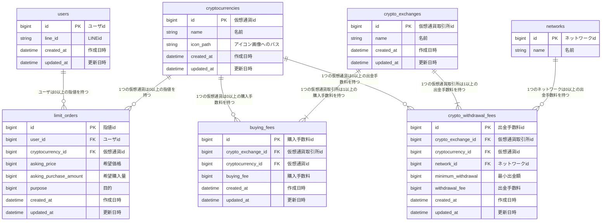

## ■ サービス概要

最も安く仮想通貨を購入できる国内取引所を、ユーザ毎にリアイルタイムに表示する。

購入したい仮想通貨/購入金額（JPY）を入力し、取引所名を出力する。

証券会社と比べると、どの取引所が良いという総意は明確でなく、仮想通貨投資を始めにくい要因となっているため。

## ■ このサービスへの思い・作りたい理由

仮想通貨は国家に認められてきている資産である。実際に、米国では 2024 年にビットコイン ETF が承認された。

しかし、証券会社と比べると、どの取引所が良いという総意は明確でない。

そのため、どの取引所を選べば良いのか迷いやすく、仮想通貨投資を始めにくい要因となっているのではと考える。

私自身どの取引所を使うのが手数料が安いのかよくわからなくて、仮想通貨を購入するのを躊躇しているため、自動で計算してそれを解決するツールを作りたい。

## ■ ユーザー層について

これから仮想通貨を始めたいが、どの取引所を使えば良いのかよくわかっていないユーザを想定している。

ただし、リアルタイムに売買価格は変化し、それに合わせてどの取引所が最も安く購入できるのかは変化すると考えているため、仮想通貨投資をするユーザならだれでも利用価値はあると思っている。

## ■ サービスの利用イメージ

ユーザの希望する購入金額（JPY）を入力してもらい、それに応じて、どの取引所を使用と一番手数料が安く購入できるのかを表示することで、どの取引所を選べば良いのかというところで迷わず済み、購入しやすくなる。

拡張としては、ユーザ登録することで、あらかじめ指定した金額で指定した量以上に仮想通貨を買える時、LINE で通知できるようにする。

## ■ ユーザーの獲得について

仮想通貨投資を最近始めた知人に使用してもらう。

また、LINE のオープンチャットなど、最近仮想通貨投資を始めた人がいそうな場所で、便利なものを作ったので使ってくださいとお願いする。

## ■ サービスの差別化ポイント・推しポイント

[coingecko](https://www.coingecko.com/ja/%E3%82%B3%E3%82%A4%E3%83%B3/%E3%83%93%E3%83%83%E3%83%88%E3%82%B3%E3%82%A4%E3%83%B3)：各仮想通貨取引所の売買価格を表示する。

[Coin Choice](https://coinchoice.net/btc_rate/)：各仮想通貨取引所の売買価格から、優位なアービトラージを提示する。

ただし、両者とも、最も手数料の安い取引所を提示する機能はないし、それを目的としたサービスでもない。

## ■ 機能候補

### MVP リリース時

購入したい仮想通貨/購入金額（JPY）をユーザが入力し、最も手数料の安い取引所名を出力する。

### 本リリース時

複数の仮想通貨に対応。

複数の用途に対応。（例、仮想通貨を購入するだけでなく wallet に送金したい場合、最も手数料の安い取引所名を表示）

ユーザ登録及び、LINE 通知機能。

## ■ 機能の実装方針予定

- 開発環境：Docker
- サーバサイド：Rails 7.0.4、Ruby 3.1.4
- フロントエンド：Hotwire（MVP リリース時）、Vue.js（本リリース時）
- CSS フレームワーク：Tailwind CSS
- Web アプリケーションサーバ：Fly.io
- ファイルサーバ：AWS S3（本リリース時）
- データベース： PostgreSQL
- VCS：GitHub
- CI/CD：GitHubActions
- 売買価格取得：各取引所の API（coincheck、GMO コイン、bitflyer、bitbank、bittrade、bitpoint）
- 各取引所の手数料：手打ちで実装
- LINE 通知：LINE Messaging API

## ■ 画面遷移図

[画面遷移図](https://www.figma.com/design/yuvu9yFSfaiGoYHuGt70Y9/crypto-exchange?t=v3tWbidK2LiGjN67-1)

## ■ER 図

